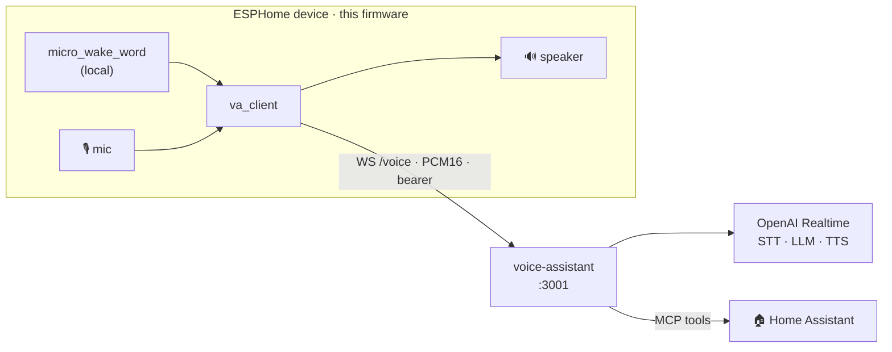

<div align="center">

# 🗣️ home-assistant-voice-pe · va-direct fork

**ESPHome firmware that turns a voice device into a thin client streaming audio
straight to a [`voice-assistant`](https://github.com/maxmaxme/voice-assistant)
backend** — no Home Assistant `voice_assistant` pipeline on the audio path.

[-blue.svg)](LICENSE)
[](https://github.com/esphome/home-assistant-voice-pe)

</div>

---

A customized fork of
[`esphome/home-assistant-voice-pe`](https://github.com/esphome/home-assistant-voice-pe).
It replaces the stock ESPHome `voice_assistant` component with a custom
**`va_client`** component that opens a plain WebSocket to a backend and streams
**PCM16 audio both ways**. The backend ([`voice-assistant`](https://github.com/maxmaxme/voice-assistant))
runs an OpenAI **Realtime** session — STT, the LLM, and TTS all happen there.
Home Assistant is no longer on the audio path; the backend uses it only as an
MCP tool backend.

Wake word and all LED/UX still run **locally** on the device; on Voice PE the
XMOS co-processor still does AEC / NS / IC / AGC. The device is, in short, a thin
mic-and-speaker client.

## 🧭 How it works



`idle → listening → thinking → replying` phases are driven by JSON messages from
the backend; binary frames are raw PCM16. The contract lives in voice-assistant's
`src/realtime/protocol.ts` — **change both sides in lockstep**.

## 📟 Supported devices

| Config (flashed)                     | Device                                  |
| ------------------------------------ | --------------------------------------- |
| `home-assistant-voice.va-direct.yaml` | [Home Assistant Voice PE](https://www.home-assistant.io/voice-pe/) (XMOS DSP, LED ring) |
| `atom-echo-s3r.va-direct.yaml`        | M5Stack Atom Echo (ESP32-S3R)           |

Both pull the `va_client` component from `esphome/components/` (local) and run
`micro_wake_word` on-device (`okay nabu` / `hey jarvis`, plus `stop` to
interrupt). The upstream configs (`home-assistant-voice.yaml`, `.8mb.yaml`,
`.factory.yaml`) are kept untouched for reference / upstream sync — they are not
built here.

## 🔧 The `va_client` component

`esphome/components/va_client/` (`va_client.h` / `.cpp`, `__init__.py`,
`automation.h`). Built on `esp_websocket_client` (esp-idf). It pulls mic frames
and ships PCM16 up, buffers incoming audio in a PSRAM ring buffer for smooth
playback, runs the phase state machine, reconnects with exponential backoff, and
trips `on_repeated_failure` after repeated handshake failures. The deep dive —
phase semantics, watchdogs, the AEC/follow-up caveat — is in
[CLAUDE.md](CLAUDE.md).

> **Follow-up turns are server-driven.** After a spoken reply the bridge sends a
> `follow_up {ms, chime?}` event (before the end-of-turn idle) telling the device
> to reopen the mic so you can continue without a wake word; a silent
> `wait_for_user` or a barge-in does not. Window length and whether a question
> plays a chime are both set in the voice-assistant web panel (defaults: 8 s, 0
> disables; chime off). See CLAUDE.md.

## 🚀 Build & flash

Stock ESPHome workflow. Flashing is OTA (the devices ship on Wi-Fi); target each
unit by IP since `name_add_mac_suffix` makes the hostname unpredictable:

```bash
esphome run home-assistant-voice.va-direct.yaml --device <voice-pe-ip>
esphome run atom-echo-s3r.va-direct.yaml        --device <atom-echo-ip>
```

The local `va_client` component is picked up automatically via each config's
`external_components:` block. USB-C is only a recovery fallback.

## 🔑 secrets.yaml

Gitignored. Provide:

- **Wi-Fi credentials** (as in stock).
- **`va_device_token`** — this device's bearer for the backend WebSocket.
- **`va_url`** — the backend endpoint where used, e.g. `ws://va.local:3001/voice`.

The backend authenticates **per device**: it hashes the presented token and
looks one up among its registered `voice` identities. So register each device's
`va_device_token` in the backend — its web panel **Users** page, or
`npm run users -- attach-voice --user <id> --token <token>`. An unregistered
token is rejected at the handshake (`4401`) and the failure chime trips after a
few retries. There is no shared backend env token.

## 🔁 Relation to upstream

Stay close to `esphome/home-assistant-voice-pe` so upstream fixes for the XMOS /
voice-kit / LED stack can be pulled in. The fork-side delta is intentionally
small: the **`va_client` component**, the **`*.va-direct.yaml`** configs, and
`secrets.yaml` keys. Avoid editing upstream files unless cherry-picking from
upstream or fixing something that genuinely needs a fork-side change.

**Changes from upstream (2026):** added `esphome/components/va_client/` (GPLv3)
replacing the stock `voice_assistant` audio path, and the `*.va-direct.yaml`
configs that wire it (mic, speaker, LED phases, error chime). The original
`home-assistant-voice.yaml` is left untouched.

## 📄 License

Unchanged from upstream — the **ESPHome dual license** (see [LICENSE](LICENSE)):
C++/runtime files (`.c .cpp .h .hpp .tcc .ino`) are **GPLv3**, everything else is
**MIT**. The `va_client` component is therefore GPLv3.
